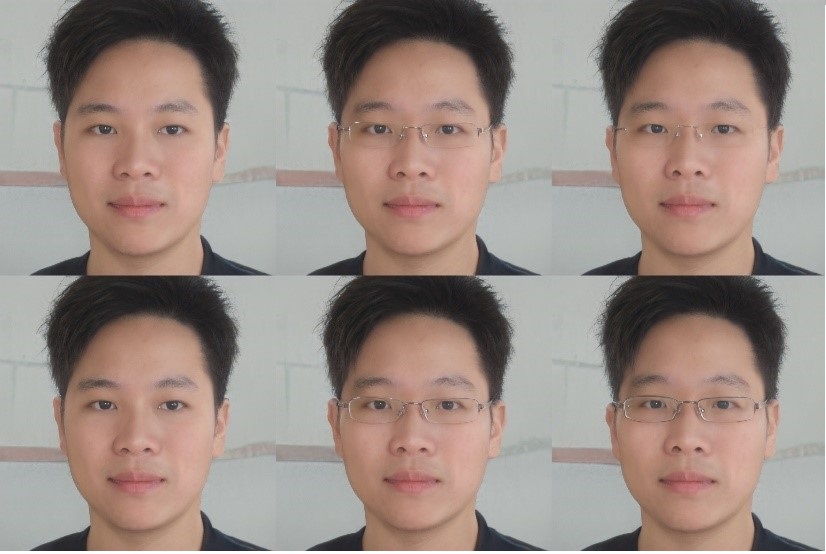
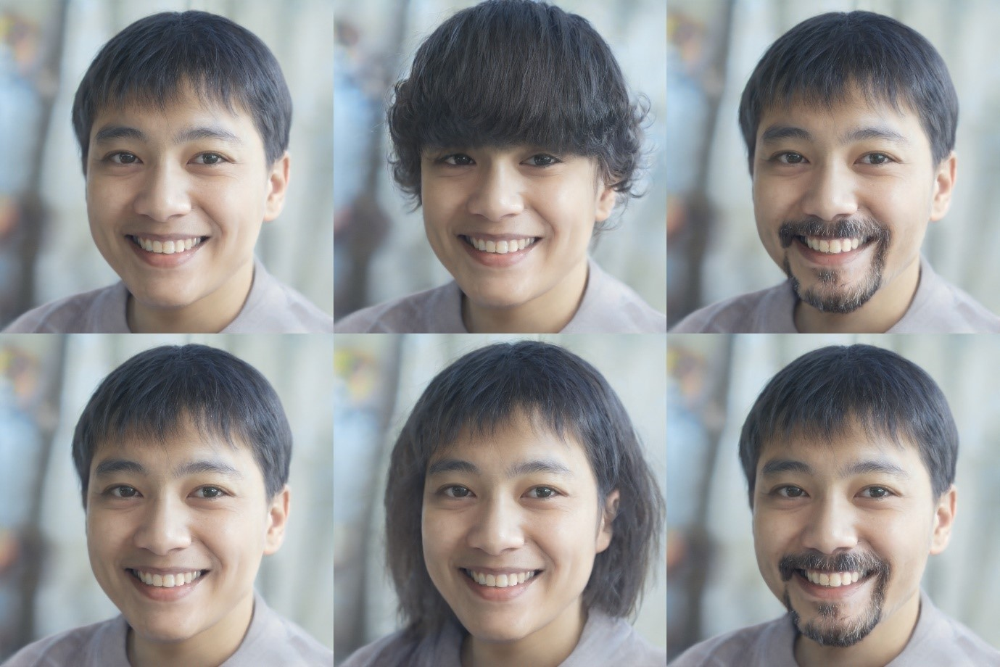
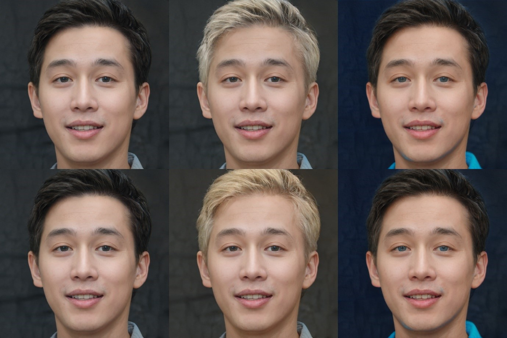

# Text-Driven-Face-Image-Manipulation
Dự án vẽ và chỉnh sửa ảnh mặt người từ câu văn mô tả. Mô hình được xây dựng bằng kết hợp mô hình xử lý ngôn ngữ tự nhiên BERT và môn hình sinh tạo ảnh GAN - trong đó mô hình sinh nổi tiếng và được sử dụng trong bài này là mô hình StyleGAN2. Ngoài ra còn có mô hình phụ trợ giúp mã hóa ảnh thành vector giúp máy hiểu để tinh chỉnh vector giúp StyleGAN tạo ảnh mới là mô hình nghịch sinh invert GAN, được sử dụng trong bài là mô hình Encoder for editing
Một số mẫu kết quả
## Thử thêm mắt kính và độ dày của nó

## Thử thay đổi mái tóc

## Thử thay đổi màu tóc và màu mắt thành mắt xanh

